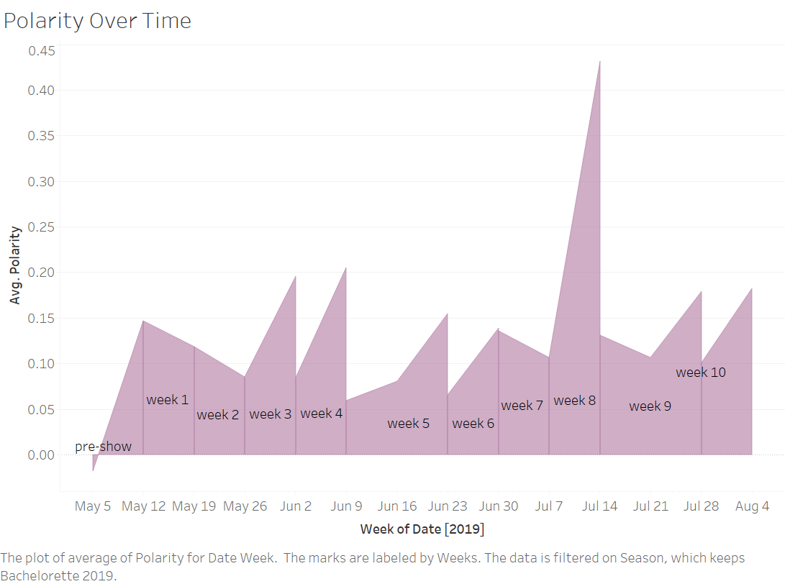

```{r setup, include=FALSE}
knitr::opts_chunk$set(echo = TRUE)
library("rjson")
```

**Trying to find love in the 21st century? The Bachelor franchise can help!** Twitter and television shows, The Bachelor and The Bachelorette, are key components of American culture today. These two shows are part of a 'Bachelor' franchine where about 30 contestants compete for the love of one person, with the star rotating between male and female each season. This project seeks to better understand the relationship between Twitter and the Bachelor franchise. Using text analysis, we explore the polarity of tweet content as well as associated words that people use to describe the show. These trends are visualized and vary by state, show season, and time.

This project utilizes two years worth of Twitter data, which was generouly shared with us by [Professor Mike Izbicki](https://www.cmc.edu/academic/faculty/profile/michael-izbicki). Data is stored on a supercomputer as a series of JSON files and is too large to host locally. Accessing this data involved working through the terminal to ssh into the supercomputer. 

We parsed the JSON files into smaller CSV's using a Python script (cs_data.py) that used zipfile and pandas [@zipfile; @pandas]. Parsing the data enabled us to condense the information we needed; for instance, in the original JSON, there are over 20 variables, such as geographic coordinates, country codes, retweets and likes, etc. We only needed a subset of this information, such as date, geographic location, and tweet content. Parsing a subset of the original data made extracting the relevant tweets more computationally efficient, taking only half an hour to extract four seasons worth of Twitter data (one season of the bachelor and bachelorette per year). An example of the original Twitter data in its JSON format can be displayed below (this example is for a single tweet) using the rjson package [@rjson]:
```{r}
json_data <- fromJSON(file="example_json.JSON")
head(json_data)
```

Data for each season was extracted by looking at the dates between times contestants were announced and one week after the final episode was aired. This enabled us to narrow down tweets that were relevant to each season. For each season, a set of key words were generated and used to identify relevant tweets. Key words included the Twitter handle of each contestant, as well as 'thebachelor', 'thebachelorette', and 'bachelorabc'. Intially, words like 'bachelor' were included, but this led to high amounts of noise. By narrowing the key words to contestants' Twitter handles and the three other bachelor-related words, the data set became significantly smaller, but we are more confident that the tweets are relevant to the show of interest. Each contestant's name, age, twitter handle, and more, were accumulated by the group members of this project and made into CSV files (by season). This process was much faster than creating a scraper for the wikipedia data, since we were only looking at four wikipedia pages of data which were about The Bachelor in 2018 [@wiki_bach_2018], The Bachelor in 2019 [@wiki_bach_2019], The Bachelorette in 2018 [@wiki_bachT_2018], and The Bachelorette in 2019 [@wiki_bachT_2019]. We used the twitter handles in this data set to narrow down the original twitter data and to gain a clearer picture of each season. In addition to parsing tweets into geographic location, time, and tweet content, we were also able to measure the sentiment of each tweet. A package called TextBlob [@textblob] was used to assign sentiment from a scale of -1 to 1, with -1 being negative, 0 being neutral, and 1 being positive. 

For the most part, Textblob was able to correctly identify positive or nergative sentiment, but there were some caveats to this package. Textblob is a useful tool to measure sentiment, but it does possess a few flaws, such as struggling to identify slang terms and incorrectly spelled words. For instance, tweets of "Booooooooo" or "Betty is an awesum person" would both be assigned neutral sentiment, when in reality they are negative and positive, respectively. Though, it performs well with nouns, which is useful when assigning sentiment to tweets that reference a contestant by their Twitter handle. For every instance that TextBlob was unsure about sentiment, a value of 0 was assigned. Therefore, we expect that there will be many tweets with neutral sentiment.

A critical problem of this method is dealing with contestants who do not have a Twitter handle. This was extremely problematic for The Bachelorette 2018, because the winner of the season had no Twitter account. To compensate for this, we parsed a second dataset for this season. This is likely to be a noisy dataset, but the results of the model can be compared to see if the noise made a significant impact. Another flaw in the data was the varying size of each data set. For instance, The Bachelor 2018 was very large, consisting of 1,914 tweets. This is likely due to the fact that this season had a unique ending where the Bachelor ended up leaving the winner, who we already proposed to, for the runner-up in a very short time frame. Other seasons had very few, nearly 300 tweets. This is something to be mindful of when interpreting results. An example of parsed Twitter data from The Bachelor 2018 can be found below:
```{r}
cleaned_data <- read.csv(file = 'Bachelor_2018.csv')
cleaned_data$text<-strtrim(cleaned_data$text, 50)
cleaned_data$text<-paste0(cleaned_data$text, "...")
head(cleaned_data)
```

For the visualizations, we created two main data sets. The reasoning behind creating the data sets was to simplify the process of the visualizations. Once the data was in the exact format that was needed for Tableau, it was straightforward to create interactive images. The first data set was very similar to the parsed data from twitter and included the same polarity, state, and text columns. We first took the data from github (using RCurl [@RCurl]) for each season and transformed it from the parsed twitter data. We wanted to assign the tweets to a week in the show: e.g. week 1, week 2, etc. In order to do this, the date needed to be in a format of Y-M-D. To separate the original date value to begin the formatting we used tidyverse[@tidyverse]. Once the original date was separated, unnecessary variables like 'time' were elimated and the Y-M-D format was put together using lubridate [@lubridate]. A small part of the code used to transform the date for the bachelor in 2018 is below:
```{r eval = FALSE}
#looking at the most informative lines 

bachelor_2018<-separate(bachelor_2018, date, into = c("day", "month", "date", "time1",
"time2", "year"), sep = " ", remove = TRUE)
#covert the months to numbers
bachelor_2018$month[which(bachelor_2018$month == "Dec")] = "12"
#select the relevant variables for the new data set
bachelor_2018 <- bachelor_2018 %>%
  select(month, date, year, polarity, state, text)
#y-m-d format
form.dates <- ymd(paste(bachelor_2018$year, bachelor_2018$month, bachelor_2018$date,
                        sep = "-"))
#overwrite dates column with new dates
bachelor_2018$date<-form.dates

```
The next step in creating the new dataset was to assign a week value according to the weeks in the season on Wikipedia. To do this, we looked at the dates in specific time frames and assigned weeks based on those values. The process of finding the time frames had to, unfortunately, be done by hand and not using lubridate because some "weeks" actually stretched more than 7 days. The "week" assignment was according to the Wikipedia assignment, not actual weeks. The dates differed from season to season but the beginning of the process for assigning each week in The Bachelor 2018 is shown below:

```{r eval = FALSE}
#create and assign a weeks column based on dates taken from wikipedia
bachelor_2018<-bachelor_2018 %>%
  mutate(Weeks = case_when(
    between(date, as.Date("2017-12-09"), as.Date("2017-12-31")) ~ "pre-show",
    between(date, as.Date("2018-01-01"), as.Date("2018-01-07")) ~ "week 1"
    #continued...
  ))
```

Finally, we created a column that stored the name of the season and the finalized data for the season was written to a csv file. The process of these two actions is below:

```{r eval = FALSE}
#create a variable that assigns the season to each row
bachelor_2018<-bachelor_2018 %>%
  mutate(Season = "Bachelor 2018")

#create a csv of the new, altered data
write.csv(bachelor_2018, file = "bachelor_2018.csv")
```

This process was repeated for the other 3 seasons of The Bacehlor. 4 different csv's were output, each containing the data for the respective seasons. The final step was to combine all the data sets for each season into 1 large data set. The large, combined data set is the main data set used for the map and graph visualizations in Tableau. This data set allowed a for a simple way to filter visualizations by season and week, without very much additional manipulation in Tableau.

The next step is to prepare a data set that will be useful in creating a word cloud visualization in Tableau. We began with the data sets previously created that were separated into `bachelor_2018`, `bachelor_2019`, `bachelorette_2018`, and `bachelorette_2019`. We began by collapsing each the text column in each data set into a single cell. The next step was to separate each word in the cell and include the count. The unnest_tokens() function from tidytext [@tidytext] was used to split the words to have one word per row. The words were then sorted by decreasing order of count. We looked at the words in each season and chose to exclude certain words that we didn't consider relevant in explaining the tweets. These words were called "bad_words". However, we were unable to completely eliminate all irrelevant words, specifically individual letters. For example, the letter "i" was unable to be eliminated from the word counts because every word that contained "i" would also be excluded. We later addressed the noisy words we had to leave in by removing them while creating the Tableau visualizations. Once the noisy words were excluded, the word counts data set was run again and output the top 200 entries for every season and all the seasons combined (5 total data sets). The 2 columns in each data set were the words and the count of each word. Only the top 200 entries were included in order to make the data set more manageable to work with in Tabeleau and for sake of relevancy. Below is a few of the most important/interesting lines of the R code for creating The Bachelor 2018 word count data:

```{r eval = FALSE}
#most informative lines extracted

#collapse each text column in each data set into one cell
sentiment_bachelor_2018 <- paste(unlist(bachelor_2018$text), collapse = " ")

#separate each word in the cell and get the number of occurences of each word
data_bachelor_2018 <- data_bachelor_2018 %>% unnest_tokens(word, category) %>%
  group_by(word) %>%
  count()

#new word counts excluding the irrelevant words
data_bachelor_2018<-data_bachelor_2018[!grepl(paste(bad_words,collapse="|"),
                                              data_bachelor_2018$word),]

#words and their counts for each file written to csv format
write.csv(data_bachelor_2018, file = "bachelor_2018_word_count.csv")
```
The above process was repeated for the other 4 data sets.

Below is the first few entries in the word count data set looking at all the seasons (including some 'bad' words later filtered out in Tableau):
```{r}
count_data <- read.csv(file = 'all_count.csv')
head(count_data)
```

Our main objective in making visualizations was to visualize trends or topics that people frequently mentioned and expressed and opinion about on social media. In addition, we wanted to visualize variations in trends based on state, show season and time. All [visualizations](https://public.tableau.com/profile/ethan3912#!/vizhome/TheBacheloretteVisualizations/Dashboard1) associated with this project were generated in Tableau and published on Tableau public. Some examples have been elaborated upon below.

(a)For visualizations, we wanted to first understand how polarity varies across the United States. The parsed Twitter data initially had latitude and longtitude coordinates which allowed us to attach approximate state locations for each tweet. Furthermore, creating a map visual required the polarity values and state geotags for each tweet. Above is a map displaying average polarity of tweets related to the show seasons we are considering (The Bachelor and The Bachelorette, 2018 and 2019) across all weeks each show is aired. We can see that, on average, tweet sentiment is generally positive across all states, indicated by the blue indicator color. On the other hand, across all show seasons, it seems that Twitter sentiment in Delaware is on average negative, indicated by the red indicator color.

(b)For our map visualizations, our online published version has an interactive feature where the user can toggle the map's display by show season and week. Additionally, the user can hover their cursor over each individual state to check the tweet volume in a state for the toggled conditions. This can help provide context as to how many tweets are contributing to the average polarity of a particular state. Above is a map displaying average polarity of tweets related to The Bachelor in 2018 on the airing of the last episode and the following week after (week 10). We can see that, based on the deep blue indicator color, tweets about the show from Nevada and Wyoming, on average, had the most positive sentiment. On the other hand, tweets about the show from West Virginia and North Dakota, on average, had the most negative sentiment, indicated by the more saturated red indicator color. 

(c)To accompany the map visualizations, we created an accompanying visualization that represents Tweet volume by state. This functions the same as the hover feature on the map visualization; however, this visualization adapts based on the toggle settings applied to the map visualization, requiring no user input. On the online interactive version, the user can toggle show season and week on the map visualization to compare polarity by state and Tweet volume by state simultaneously. Above is a block graphic displaying tweet volume for The Bachelor 2018 on the airing of the last episode and the following week after which can be compared with visual (b). We can see that, New York, California and Texas dominate in Tweet volume related to The Bachelor this particular week. This helps the user carefully consider the map visualizations by recognizing how many tweets are considered for caluculating average polarity between states.

(d)In understanding how polarity varied during the airing of each show season, we created a visualization that plots polarity as a function of time, which the user can filter by show season. Above is an area graphic displaying Tweet polarity across the United States for The Bachelorette 2019 during the entire airing of the show (preshow-week 10). Furthermore, each area graphic is sectioned by week. This exists mainly because each `week` in the show does not necessarily refer to the actual numbered week in the season, and instead is more related with a particular section of the show. This enables the user to interpret polarity episode by episode, while also interpreting the direct impact of an episode on polarity. In the above graphic, we can see that sentiment was generally positive about The Bachelorette 2019 with a noticeable spike in positive sentiment during week 8. From conducting brief market research, we conclude that viewers start to express stronger positive sentiment in their tweets around week 8 due to contestants having more intimate conversations which is a catalyst for chemistry and drama. Furthermore, Hannah Brown who was The Bachelorette this season was well liked by the general public, even before the announcement of her as The Bachelorette 2019.

To understand what viewers are tweeting about the most, we created an interactive word cloud visualization that formats the most frequently used words in Tweets in a cloud format, excluding nonsensical and filler words. More frequently used words are larger in size, while less frequently used words are smaller in size. Additionally, in the online published version, the user can hover their cursor over a particular word to see the count of how many times that word was used to tweet about a particular show season or over all show seasons. Above is a word cloud across all show seasons. We can see that words such as `like`, `love`, `need`, and `omg` are often used words in tweets, as indicated by their large size, related to The Bachelor and The Bachelorette. From general knowledge of social media, we can assume that the use of these words are all commonly used in social media updates to express a sentiment (`like`, `love`) or for the act of convenience (abbreviations i.e. `omg`). Also, on the online interactive version, the user can also toggle the word cloud to only include words that fulfill a minimum word count, so that only the most frequent (or relevant) words used are displayed in the word cloud.

To follow up a word cloud that visualizes word frequencies across all show seasons, we also created individual word clouds by show season. Each word cloud also includes the feature to toggle the word cloud to only include words that fulfill a minimum word count. Above is a word cloud representing frequently used words about The Bachelor 2019. Words such as `demi_burnett`, `fence`, `sloth`, and `love` are some examples of words that are frequently used, as indicated by the word cloud. From general knowledge about the show, we know that words such as `demi_burnett` and `sloth` each are referring to particularly notable contestants on The Bachelor 2019 which were both highly tweeted about, noted by their size in the word cloud. Additionally, the word `fence` refers to The Bachelor 2019 who uncharacteristically jumped a fence out of frustration, resulting in high tweet volume with the keyword `fence`. As a result, high word frequencies can help us determine notable moments in a particular show season and unique quirks of particular seasons. Ultimately, further market research can easily be done to understand the causal and resultant factors of certain high word frequencies.

We were able to draw interesting conclusions through the use of interactive visuals. From the visuals, we gain a clear understanding on the geographic distribution of the tweets and how polarity varies across states. This allows us to facilitate comparisons between states as well, such as observing how Delaware tends to have tweets with more negative sentiment while California tends to have tweets with more positive sentiment and also how states such as New York, California and Texas have much more tweet volume than states such as Delaware and Colorado. We also were able to visualize polarity as a function of time and episode week by show season. This gives us a better understanding on people's attitudes and how they change in response to events that transpire in each episode. Lastly, we were also able to visualize the most frequently used words when discussing different seasons of The Bachelor and The Bachelorette. From all of this information, we can better understand how people on Twitter are feeling from season to season of the show, whether it is more negative or positive about a particular show season during a particular time. Ultimately, our conclusions drawn from polarity averages in each state is our most meaningful data.

An ethical consideration that we must take into account is the database of tweets that we are originally presented with. A very small number of twitter users consent to their tweets that include geographic location to be included in a publically available data set. Due to this limitation. and our very specific tweet filter words, we must critically look at the size of our data set. A full data set of slightly more than 10,000 tweets over the course of four seasons of an immensely popular TV series is unrealistic. Additionally, many people who watch the show only tweet the contestant's first name, which is incredibly difficult to account for and we were unable to include those tweets in our data set. Ethically, we must look at the accuracy of polarity, volume, and general sentiment from the lense of analysts whose subjects are far fewer than would be ideal. The most accurate visualizations and information would come from accessing all tweets. We are nevertheless able to draw meaningful conclusions from our chosen data, but with a healthy degree of skepticism.

Access to more seasons or more data would allow us to create even more insightful visualizations. This would require Twitter data from 2006 - 2017 (Twitter founded in 2006), to be available, which we could access with a paid developer account through Twitter [@history.com_2019]. Additionally, looking at polarity in specific major cities could lead to more specific insights between more specific locations. In our current project, we looked at tweet volume by state; however, it may be more meaningful in the future to look at tweet volume as proportional to population of the state. Data from more seasons would greatly increase the number and quality of conclusions we are able to draw from The Bachelor franchise data.

Furthermore, we can try to optimize the performance of Textblob so we can increase sentiment accuracy. Recall that Textblob fails when words are spelled incorrectly. We can do additional data cleaning by correcting words though Tetxblob's 'correct()' package [@textblob]. By doing so, we could get a better representation of public sentiment regarding the show.

In order to complete this project, the team had to learn to use various online tools. Firstly, the team had to learn how to interpret JSON data and parse the data into a CSV. Accessing data through a supercomputer (ssh-ing through the machine) was a major hurdle in intially collecting data and a new process that the team learned a lot from, especially since this was done in an OS and Windows context. Furthermore, string manipulation was a new technique implemented when data wrangling. In addition, generating the visualizations required learning Tableau, which none of the team members had experience in and was crucial to our most insightful findings. 

We look forward to analyzing more relationships between the Bachelor series and twitter in the future, as more data becomes available. Bachelor 2020 awaits!


# References
